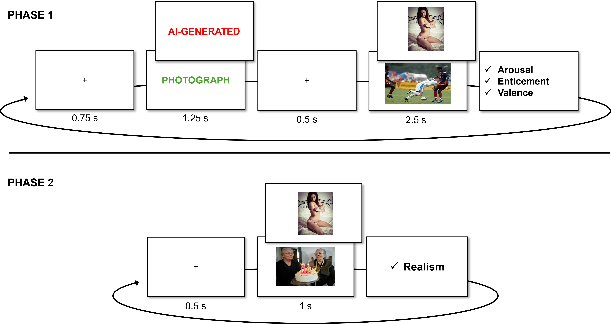
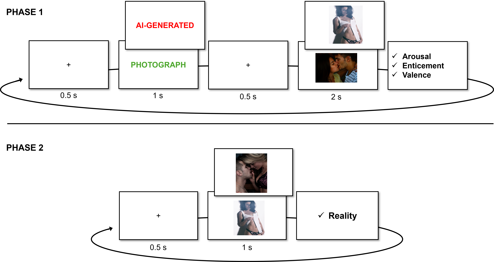

```{r}
#| label: setup
#| include: false
library(conflicted)
library(tidyverse)
library(flextable)
library(ftExtra)
library(officer)
library(knitr)

conflicts_prefer(dplyr::filter, .quiet = TRUE)
conflicts_prefer(flextable::separate_header, .quiet = TRUE)
```

```{r, echo = FALSE, warning=FALSE, message=FALSE}
# options and parameters
options(digits = 3)

knitr::opts_chunk$set(
    collapse = TRUE,
    dpi = 450,
    fig.width = see::golden_ratio(9),
    fig.height = 9,
    fig.path = "images/"
)

cache <- TRUE
```

Generative artificial intelligence [genAI; @fisher2025something] poses profound challenges for human cognition by enabling the creation of media content (e.g., images, audios, and videos) that are increasingly indistinguishable from authentic ones [@miller2023ai; @velasquez2025interpretation].
The increasing accessibility of such contents, often called deepfakes, to permeate social networks, entertainment, immersive environments, and everyday communication [@fisher2024moderating].
Whereas deepfakes once contained clear perceptual markers of inauthenticity, such as distortions characteristic of early computer-generated contents [@de2021distinct]; @mcdonnell2010face\], these cues are rapidly diminishing.

As deepfakes reach perceptual parity with their authentic counterparts, understanding how individuals evaluate and emotionally respond to such ambiguity becomes both a theoretical and practical imperative, with implications for information integrity, social trust, and the ethical deployment of AI systems.

**1.1 The prejudice against (putative) AI-generated**

Researchers have investigated the impact of authorship (human vs AI) on perceivers' appraisal across several domains such as artwork (e.g., visual, poetry, music) and biological salient stimuli (e.g., faces, people).
These studies typically manipulate either the *actual* origin of the stimulus (authentic vs AI-generated) or the participant's *belief* about its origin, and in some cases both.
Evidence has accumulated showing that participants often fail to tell apart AI-generated from human-made content at above-chance levels both in artworks [@cenerini2025artistic; @grassini2024understanding; @gangadharbatla2022role; @kobis2021artificial] and biological stimuli [@nightingale2022ai; @kramer2025ai].

Interestingly, when authorship is not disclose, AI-generated content is sometimes evaluated more positively.
For instance, AI-generated poetry has been shown to receive higher appreciation ratings (e.g., beauty, lyrically, rhythm) than human-made poetry [@porter2024ai].
Similarly, faces that are actually generated by AI are judged as more trustworthy than the real ones [@nightingale2022ai; @tucciarelli2022realness, study 1], possibly because generative algorithms are biases toward average, and familiar-looking faces, and familiarity breads trustworthiness [@miller2023ai; but see @dunn2026too].

In contrast, when some stimuli are presented as AI-generated, they are consistently evaluated more negatively than when they are presented as authentic.
Indeed, various studies document a negative bias across several culturally salient domains such as visual arts [@chiarella2022investigating; @bellaiche2023humans; @ragot2020ai; @di2023art], music [@shank2023ai; @ansani2025ai] and poetry [@porter2024ai].
More broadly, the influence of contextual information on the evaluation of cultural products is well established and extends beyond biases specific to AI.
For example, research in neuroasthetics shows that presenting an artwork as an original rather than a (human-made) copy can alter both its perceived worth [@newman2012art] and associated neural responses [@huang2011human].
These findings suggest that evaluative processes are highly malleable to contextual cues and beliefs about the origin of the stimuli.
And "anti-AI bias" makes no exception, inasmuch it seems driven primarily by cognitive evaluations tied to beliefs about authorship, as shown by the appreciation of "blinded origin" AI-made stimuli.

Interestingly, despite being strongly constrained by evolutionary pressures, more biological salient stimuli such as the perceived appear of food [@califano2024assessing] or human faces [@liefooghe2023natural], are also affected by the anti-AI bias.
@califano2024assessing report that, despite preferring AI-generated food when unlabeled (especially ultra processed food), as soon as labels are introduced, participants tend to prefer authentic food pictures.
@liefooghe2023natural report that faces were consistently rated as less trustworthy when presented as AI-generated as opposed to real.
@eiserbeck2023deepfake reports that smiling faces labelled as AI-generated were judged less positively, processed more slowly, and elicited reduced early emotional EEG responses.
On the contrary, subjective and EEG responses for angry faces were not modulated by the label, probably reflecting the robustness of phylogenetically rooted threat stimuli.
Similarly, @doring2025anti found that romantic images of heterosexual couples hanging out were rated more "aesthetic", "erotic", "expressive", and "vivid" when presented as photographs that as deepfakes.
Taken together, these results suggest that beliefs about authenticity selectively dampen positive affective responses when dealing with biological salient stimuli.

However, this conclusion should be interpreted with caution.
In the studies discussed above, the positive stimuli could not have been compared to the negative ones in terms of arousal, making it difficult to determine whether the observed effect truly reflects a selective dampening of positive affective responses.
One class of evolutionary salient positive stimuli that may offer a more appropriate comparison is erotic images, which are known to elicit strong motivational and attentional responses.
Indeed, erotic images have been shown to capture attention as much as, or even more than, fear- and disgusted-related stimuli [@ciesielski2010emotion].
This makes them a particularly relevant test case for examining whether contextual information, such as an AI label, can modulate responses even to highly salient positive stimuli.

**1.2 AI and erotic stimuli**

Among many other fields, AI is exerting its disruptive potential over human sexuality in several forms.
For instance, LLMs provide sexual counselling, and dedicated sexual chatbots afford spicy conversations.
However, the most widespread use of AI in sexuality is arguably generating expplicit visual contents [@doring2024impact; @lapointe2025present].
In several cases, these contents are sexually explicit deepfakes [@ajder2019state; @Security2023Hero].

Given the relevance of thse controversial applications of AI, the following questions must be posed: does the anti=AI bias generalises to sexual contents?
@easterbrook2025pornographic speculate that AI-generated pornography might be valued less inasmuch it lacks the "aura of authenticity" surrounding human-made porn.
Similarily, @viola2023designed propose that, by casting doubts about the authenticity of all mdeia, as the possibiliuty that they may be fake may undercut their allure.
Indeed, @tucciarelli2022realness shows how simply suspecting that some faces within a set *could* be AI-Generated lowered trustworhtiness score of the whole set.

Beyond the interest specific to the field of sexuality *per se*, empirically investigating whether sexual stimuli are also affected by the anti-AI bias could bear more general theoretical relevance.
Recall that sexual stimuli represent a paradigmatic category of positively valenced and highly arousing stimuli in many popular databases of stimuli for psychological research on emotion, be them visual [@lang1997international; @kurdi2017introducing; @wierzba2015erotic] or audio [@yang2018affective; @holz2022variably].

Yet, to the best of our knowledge, the only empirical findings about sexually explicit images have been collected by @marini2024real.
They performed an online experiment presenting subjects with soft erotic images (male and female models in underwear), finding that the same images were rated higher in terms of sexual arousal when judged more likely to be (in Study 1), or presented as (in Study 2) real photos–as opposed to AI-generated images.

However, @marini2024real studies are based on a sample from a single nation (Italy) and provide scant socio-demographic information.
They only investigate a single dependent variable, namely self-reported sexual arousal.
However, self-reported first-person, 'affective' feelings (“does this arouses me?”) and third-person, 'semantic' judgments (“is that supposed to be arousing?”) have been shown to dissociate in some cases [@itkes2019affective].
More relevantly, they used only mildly sexually arousing stimuli (people in underwear) not taken from a validated dataset.
Lastly, in their direct manipulation of the ‘authentic/AI-generated’ labeling (Study 2) they did not provide any explicit manipulation check.

**1.3 The present studies**

To fill our knowledge gap about the existence and the exact workings of a putative anti-AI bias about sexual content, we gathered an international team with the aim of a more exhaustive investigation.

In order to control over image properties and enable comparisons with normative data, we employed stimuli from a validated database, the Nencki Affective Picture System [@marchewka2014nencki], which includes several explicitly sexual pictures [@wierzba2015erotic], and selected the stimuli via a data-driven, easily reproducible procedures.
Moreover, we asked subjects to provide different ratings of first-person ‘affective’ subjective sexual arousal and valence, and a third-person ‘semantic’ judgment on how enticing they found the image to be.

Sociodemographic characteristics, in particular gender, were assessed as a modulator of responses to stimuli, given robust evidence that sexual patterns differ systematically between men and women.
For instance, research on arousal indicates that heterosexual men tend to exhibit greater category-specificity in their responses, such that arousal is more strongly aligned with their sexual orientation (i.e., heightened responses to female stimuli).
In contrast, heterosexual women’s responses are less category-specific and more variable across stimulus types [@chivers2004sex; @chivers2017specificity; @huberman2015gender; @safron2020neural].

Furthermore, the present studies assess whether individual differences in attitudes towards AI influence responses to the stimuli.
Beliefs about the origin of a stimulus can bias evaluations, yet it remains unclear whether this effect depends on individuals’ pre-existing attitudes towards AI.
Previous findings suggest that such moderation is inconsistent and may be domain-specific.
In domains where creativity and authenticity are salient (e.g., art and music), stronger anti-AI biases are often observed [e.g., @ansani2025ai], whereas informational contexts (e.g., news) sometimes show a pro-AI bias, with machine-generated content perceived as less biased [e.g., @cloudy2022ai].
In contrast, research using human faces and bodies consistently finds no reliable moderating role of AI attitudes on evaluative or affective responses [e.g., @liefooghe2023natural; @marini2024real].
Some evidence, however, suggests that broader constructs such as AI readiness may attenuate anti-AI bias (i.e., composite of positive AI attitudes and higher AI literacy; @doring2025anti).
Overall, the influence of AI attitudes on evaluations appears variable and context-dependent, with particularly limited effects observed in the domain of human appearance.
Accordingly, the present study includes attitudes towards AI as a potential moderating variable to test whether individual differences in these attitudes shape responses to the stimuli.

Finally, the present study also considers participant’s sexual behaviours as moderators of responses to sexual stimuli.
For example, research indicates that frequency of pornographic consumption can influence attentional and evaluative processing of sexual content.
Repeated exposure to pornographic material has been associated with attenuated allocation of automatic attentional resources to sexual stimuli, suggesting a degree of habituation [@carvalho2018gender].
Furthermore, evidence suggests that individuals with lower pornographic use rate erotic stimuli as less pleasant compared to those with moderate or high levels of consumption, indicating that prior exposure shapes subjective appraisal of sexual content [@kunaharan2017conscious].
Similarly, although less frequently examined, frequency of sexual activity may serve as an index of experiential familiarity with sexual stimuli and thus moderate responses.
Greater sexual experience has been linked to differences in neural sensitivity to explicit content [@prause2015modulation], and heightened self-reported sexual excitation [@walton2018hypersexuality], although state subjective arousal ratings do not consistently vary [@youn2006subjective].
Together, these findings suggest that both attentional engagement and explicit evaluations of sexual stimuli are contingent on individuals’ prior experiential exposure, whether through pornography consumption or sexual activity.

Since the proliferation of generative AI has likely put several subjects on their toes when it comes to telling apart authentic and synthetic perceptually indistinguishable media, we devised post-hoc controls of the effect of belief manipulation.
Moreover, given that not only the feeling of reality could alter the affective reaction, but the effect in the other direction is also possible–namely, that the affective reaction impact on how real something is perceived [@sperduti2017distinctive; @makowski2019phenomenal; @makowski2025too], we explicitly measured whether some of the above-mentioned affective variables (arousal, enticement, valence) predicted the 'feeling of reality' of the images.

# Study 1

In our first study, we aimed at gauging whether the prejudice against AI-generated erotic stimuli shows up in a wide and heterogeneous sample, and whether it is moderated by demographic factors, by sexual activity or pornography consumption habits, or by attitudes toward IA.
Following @marini2024real, we hypothesise that images presented as AI-generated will elicit lower ratings than those presented as photographs.
Additionally, in line with the literature on explicit stimuli [@chivers2004sex, @huberman2015gender; @safron2020neural], we hypothesise erotic images relevant to participants' sexual orientation would result in higher ratings than erotic but irrelevant images and non-erotic images, and that these differences would be less pronounced for women.
Research on general attitudes towards AI and its moderating role on ratings is mixed, with some studies finding a moderating effect [@doring2025anti] and others not [@liefooghe2023natural; @marini2024real].
As such, we explore whether attitudes towards AI moderate responses to the stimuli, without making a strong directional prediction.
Lastly, we hypothesise that higher frequency of pornographic consumption will be associated with higher evaluative ratings of sexual stimuli, consistent with prior findings [e.g., @kunaharan2017conscious].
No directional hypothesis is proposed for frequency of sexual activity due to mixed evidence regarding its influence on subjective responses.

While prior studies have examined the effect of AI labels on affective ratings, relatively little attention has been paid to whether participants actually believe those labels, and whether belief itself modulate the observed effects.
If participants second-guess the authenticity claims (e.g., suspecting that "AI-generated" images are in fact photographs, or vice versa), label-based effects would be attenuated or reversed regardless of the manipulation's objective content.
This concern is not without empirical basis: @tucciarelli2022realness showed that when participants were informed that some faces in a set might be AI-generated, their responses were driven not by the objective category of each face, but by their own judgment of whether that specific face was real — suggesting that individual beliefs about stimulus authenticity, rather than assigned labels, shape evaluative and social responses.
Accordingly, we assess the role of individual belief in the label as an additional predictor of affective ratings, without a directional hypothesis, given that disbelief in a label can shift ratings in either direction depending on what the participant believes the image actually is.

## Methods

**Participants**

The initial sample comprised 1,067 participants recruited via multiple channels, including Sona Systems, social media platforms, university classrooms, and snowball sampling.
This strategy yielded a heterogeneous pool of both incentivised and non-incentivised individuals, including students and members of the general population from England, France, Italy, Colombia, and Spain.
Data collection occurred from the 19th of January to 1st of June 2024 (during this time the best image generator was OpenAI’s DALL·E 3).
To ensure data quality, several exclusion criteria were applied.
Participants were removed if they (a) showed no variation in arousal ratings across trials (N = 8), (b) displayed a negative correlation between arousal and enticement alongside lower arousal ratings for erotic compared to neutral stimuli, suggesting a possible misunderstanding of scale direction (N = 4).
Due to small subgroup sample sizes, participants identifying with a gender other than Female or Male (N = 15), or a sexual orientation other than Heterosexual (N = 315), were excluded from further analysis.
The final sample consisted of 705 participants (Mean age = 30.2 years $\pm$ 11.8; 35.7% female).
Participants were primarily from the United Kingdom (28.23%), Italy (18.72%), the United States (14.33%), and Colombia (11.06%), with the remaining 27.66% distributed across other countries.
Ethical approval for this study was obtained from the School of Psychology Ethics Committee at the University of Sussex (ER/MHHE20/1).

### Materials

All written materials in this study were translated into the participants’ native languages: English, French, Italian and Spanish.

#### Questionnaires

The *Beliefs about Artificial Image Technology* (BAIT) was developed to evaluate beliefs about computer-generated imagery, such as “Current Artificial Intelligence algorithms can generate very realistic images” and “Images of faces or people generated by Artificial Intelligence always contain errors and artifacts.” The BAIT includes 4 dimensions with 2 items each: Text ($\alpha$ = .63) , Videos ($\alpha$ = .56 ), Images ($\alpha$ = .38), Environment ($\alpha$ = .58 ).
Items were rated on a continuous scale from strongly disagree (0) to strongly agree (1).
One item was included to assess self-reported AI knowledge, with anchors ranging from Not at all (0) to Expert (6).
A modified version of the General Attitudes towards Artificial Intelligence Scale (GAAIS; Schepman & Rodway, 2020, 2023) was used, containing 3 items assessing positive (e.g., “Artificial Intelligence is exciting”) and 3 items assessing negative attitudes (e.g., “Artificial Intelligence might take control of people”) towards AI.
The resulting GAAIS subscales showed acceptable reliability: Positive ($\omega$ = .72), Negative ($\omega$ = .73).
All items were rated on a continuous scale from strongly disagree (0) to strongly agree (1).

A modified version of the *General Attitudes towards Artificial Intelligence Scale* [GAAIS, @schepman2020initial; @schepman2023general] was used, containing 3 items assessing positive (e.g., “Artificial Intelligence is exciting”) and 3 items assessing negative attitudes (e.g., “Artificial Intelligence might take control of people”) towards AI.
The resulting GAAIS subscales showed acceptable reliability: Positive ($\omega$ = .72), Negative ($\omega$ = .73).
All items were rated on a continuous scale from strongly disagree (0) to strongly agree (1).

The *Consumption of Pornography Scale – General* [COPS, @hatch2023consumption] is a 34-item measure assessing pornography use across multiple dimensions, including frequency, duration and recency of sexual activity.
Participants reported how often they had viewed pornography in the past 30 days (e.g., not at all, once or twice, weekly, daily, multiple times per day) and the typical duration of viewing sessions (less than 5 minutes to 46+ minutes).
An additional item assessed the recency of any sexual activity (intercourse or masturbation), with response options ranging from within the past 24 hours to more than a year ago.
Internal consistency for the COPS was acceptable ($\omega$ = .66).

#### Feedback

Feedback was collected at the end of the experiment.
Participants were able to provide open-ended comments and to select one, multiple, or no options, from several predefined statements (10 in total).
These statements assessed whether they found the experiment fun or boring; whether they could distinguish which images were AI-generated or perceived no difference between photographs and AI-generated images; whether they felt the AI-generated images were more or less arousing; whether they believed the labels were inaccurate or reversed; and, more generally, whether some images were particularly arousing or elicited no emotional response.

**Procedure**

```{r}
#| warning: false
#| label: "fig-paradigm1"
#| apa-twocolumn: true  # A Figure Spanning Two Columns When in Journal Mode
#| out-width: "100%"
#| fig-cap: "Overview of the experimental procedure for Study 1. A) Phase 1: Participants viewed a randomized sequence of erotic and non-erotic images. After each image, they provided ratings on three dimensions: sexual arousal, enticement, and affective valence. B) Phase 2: The same set of images was presented again in a new random order. This time, participants rated each image based on its perceived realism (i.e., how photographic or lifelike it appeared)."



```

The study was conducted in line with the born-open principle [@de2024datapipe], ensuring transparency and reproducibility at every stage.
The experiment was implemented entirely in jsPsych [@de2015jspsych], with the full code hosted publicly on GitHub, which also served as the platform for running the online study.
Raw data were automatically stored in a private Open Science Framework (OSF) repository.

Participants first provided informed consent before completing a short demographic questionnaire covering gender, age, ethnicity, country of residence, education, and English proficiency.
Optional questions on birth control use were also included.
They then proceeded to the experimental tasks (see @fig-paradigm1).

In the first phase, participants were given the following instructions:

> In this study, we aim at validating our new image-generation algorithm (based on a new form of Generative Adversarial Network – GAN – technology) trained to produce high-quality erotic (but also non-erotic) content.
>
> In the following task, you will be presented with erotic and non-erotic images generated by our algorithm (preceded by the word 'AI-Generated') intermixed with real photos (preceded by the word 'Photo') taken from public picture databases.

Participants were informed that their task was to rate each image on three dimensions: arousal and enticement, each on a continuous scale from Not at all (0) to Very much (1), and valence, on a continuous scale from Unpleasant (-1) to Pleasant (1). Definitions for each affective rating were also provided:

> *Arousing*: How much do you find the image sexually arousing? This question is about your own personal reaction felt in your body when seeing the image.
>
> *Enticing*: How enticing and sexually appealing would you rate this image to be. Think of how much, in general, people similar to you in terms of gender and sexual orientation would like it.
>
> *Valence*: Did the image evoke a positive and pleasant (not necessarily sexual) feeling in you, or could it be better characterised as negative and unpleasant? Think of how much you did enjoy (or not) looking at the images.

Each participant viewed 60 images in total: 40 erotic images (20 male and 20 female) from the Erotic subset of the Nencki Affective Picture System [NAPS ERO, @wierzba2015erotic], and 20 non-erotic images (10 neutral, 10 positively arousing) from the original NAPS database [@marchewka2014nencki]. 
The final stimuli were selected by sampling, within each category (male, female, faces, and people), the height highest, and two lowest, arousal erotic images based on gender-specific ratings for men and women, with no overlap between sets. 
Non-erotic images were selected by computing average arousal across men and women, with 10 low-arousal images, and 10-high arousal images (restricted by positive valence stimuli). 
Each trial followed a fixed timing sequence: a fixation cross (750 ms), a color-coded textual label (1,250 ms), another fixation cross (500 ms), then the image (2,500 ms). Labels were presented in red, green, or blue, with colours randomly assigned. 
Additionally, the labels “AI-generated” or “Photograph” were presented to  indicate the authenticity of the images, and were randomly assigned. 

Following each image, participants rated their emotional response using three continuous sliders assessing sexual arousal, enticement, and valence. This phase was self-paced, with responses required before continuing.
After completing the image-rating phase, participants filled out the BAIT scale, followed by the COPS questionnaire.

In the final phase, participants were presented with the following instructions: 

> In the next phase, we would like to see if you found our image generation algorithm convincing and error-free. We will briefly present you all the images one last time (the AI-generated ones, as well as the photos), and you will have to rate them on how real (how realistic, photography-like) the image is.

Participants then viewed the same 60 images in a newly randomised order. 
Each trial began with a 500 ms fixation cross, followed by the image presented for 1,000 ms. 
As in the previous task, participants provided their ratings of Realism, using a continuous scale anchored at AI-generated (0) and Photograph (1), after viewing each image, and these ratings were self-paced.
At the end of the experiment, participants completed a feedback form. 
Finally, participants were debriefed on the true purpose of the study: to examine how image labels (AI-generated vs. real photograph) influence emotional responses. 
Importantly, they were informed that all images were real photographs, and that the “AI-generated” label was used solely to test the effect of belief on affective reactions. 
A shareable link to the experiment was also provided.

<!-- EYE-tracking data? -->

**Data Analysis**

Bayesian Linear Mixed Models were fitted separately for Arousal, Valence, and Enticement as dependent variables. 
Each outcome was predicted from Gender (Female vs. Male), Condition (AI-Generated vs. Photograph), Relevance (Relevant, Irrelevant, Non-Erotic), and Congruence (True vs. False). 
Relevance was computed post hoc based on participants’ self-reported gender and sexual orientation. 
For example, images of male-presenting stimuli were coded as “Relevant” for homosexual but not for heterosexual men.  
Congruence was also computed post hoc based on whether the chosen label in phase 2 was congruent with the one presented for that image in phase 1. 

The full formula for the models are as a follow: Outcome ~ Gender / Relevance / Condition * Congruence + (1 + Relevance / Condition ∣ Participant) + (1 | Item). 
The zero–one inflated beta (ZOIB) family [@heiss2021guide; @vuorre2019analyze]  was used to account for the distribution of the dependent variable, which showed excess responses at the boundary values (0 and 1) and weakly informative normal (0, 0.5) priors were placed on all fixed effects. 
Each model was estimated using 2,000 iterations per chain with 50% warmup - distributed across 96 chains (total post-warmup draws was 96000).  
Given the computational complexity of Bayesian mixed-effects models, all models were estimated on the University of Sussex High Performance Computing Cluster (HPC). 
The models were run using the brms package [@burkner2017brms] and analysed using the easystats collection of packages [@ludecke2022easystats; @ludecke2021performance; @makowski2019bayestestr; @makowski2025modelbased].

Firstly, to assess whether erotic images elicited higher ratings for men and women, marginal contrasts will be computed from these models, with contrasts defined over Relevance and estimated with levels of Gender. 
Secondly, to assess the effect of condition, marginal contrasts will be defined over Condition and estimated within levels of Gender and Relevance. 
Finally, the effect of Congruency between phases will be assessed using marginal contrasts defined over Condition and estimated within levels of Gender, Relevance, and Congruency. 
Effects will be considered credible when the median estimate and its associated 95% credible interval (*CrI*) do not include zero, and when the probability of direction (*pd*) exceeds 97\%, indicating a consistent effect direction [@makowski2019bayestestr]. 
Marginal contrasts were computed using the modelbased package [@makowski2025modelbased]. 
The Results section will focus on arousal ratings whilst reporting major differences with Enticement and Valence. 

To evaluate the reliability of individual-level parameters (i.e., random intercepts and random slopes for each participant and each item), the Variance-over-Uncertainty Ratio index [D-vour,@ludecke2021performance] will be computed. 
This index estimates the reliability of group-level variance by quantifying the normalised ratio of observed between-group variability to the uncertainty associated with the corresponding random-effect estimates. 
Values of D-vour greater than 0.666 indicate moderately reliable random-effect estimates, corresponding to a 2:1 ratio of between-group variance to estimation uncertainty. 
In this context, reliability refers to cases in which variability between groups (e.g., participants) exceeds the uncertainty in the estimates, suggesting that the parameter can meaningfully capture inter-individual differences.

Lastly,  a correlation matrix will be computed between the models’ individual-level estimates and potential moderators:  beliefs, attitudes towards and knowledge of AI, porn frequency and recency of sexual activity. 
Correlations, computed with the correlations package [@correlationPackage] will be used to explore whether reliable variation in the random effects can be explained by theoretically relevant individual differences. 
Pearson’s r and its associated 95% confidence interval (*CI*) will be reported and interpreted according to Pearson’s criteria (ref). 
All analyses were conducted in R (version 4.5.2). 
Anonymized data, together with all preprocessing and analysis scripts, will be openly released on [GitHub](https://github.com/RealityBending/FictionEro) to facilitate complete reproducibility.

## Results

### Distributions

As shown in @fig-dist, the distributions of arousal and enticement ratings are heavily skewed toward the lower end of the scale, with a high frequency of scores at 0 and only a slight increase in counts toward  mid-range of the scale (~0.50 - 0.75). In contrast, valence ratings exhibit a broader distribution, with frequent scores at both extremes as well as in the mid-range of the scale. 

```{r}
#| warning: false
#| label: "fig-dist"
#| apa-twocolumn: true  # A Figure Spanning Two Columns When in Journal Mode
#| out-width: "100%"
#| fig-cap: "Distributions of Arousal, Enticement and Valence ratings (i.e., rated on an analog scale from 0 to 1) for males and females across conditions. Distributions include a higher count of extreme answers (0 and 1s) justifying the use of a ZOIB model."

# knitr::include_graphics()
```

### Manipulation Checks

An initial manipulation check was conducted to assess participants’ belief in the instructional cues. Based on participants' feedback after the initial rating phase, 41.7\% of participants reported that they did not believe the labels, indicating that a large proportion of participants perceived the image classifications as incorrect.
However,  52.3\% of images were rated as being more realistic in phase 2.

To examine whether disbelief in the instructions was associated with differential responses to images labelled AI-generated versus photograph, Bayesian independent-samples t-test were conducted for each outcome variable. 
These tests compared the difference scores between AI-generated and photographic images as a function of whether participants reported that AI images were less arousing. 

For arousal, participants who reported that AI images were less arousing showed a larger difference between AI-generated and photographic images (M~difference~ = −0.02) than participants who did not report this belief (M~difference~ = −0.002). 
The t-test indicated extreme evidence for a difference between groups (BF~10~ = 2.17 × 10^604^). 
The estimated standardised effect size was large (median $\delta$ = −1.11, 95\% *CrI* [−1.13, −1.08], *pd* = 100\%).  
A similar pattern was observed for enticement and valence (for full results see analysis folder on the github link above). 


### Marginal Contrasts

#### Effect of Relevance

To evaluate whether the different stimuli (erotic relevant, erotic irrelevant, and non-erotic) elicit dissimilar responses, marginal contrasts from the mixed models were examined, focusing on the effect of relevance. These contrasts assessed differences in arousal ratings across stimulus types separately for males and females.

For males, relevant erotic images were rated as more arousing than both irrelevant ($\Delta$ = 0.43, 95\% *CrI* [0.39, 0.46], *pd* = 100\%) and non-erotic images ($\Delta$ = 0.44, 95\% *CrI* [0.40, 0.47], *pd* = 100\%). 
For females, relevant erotic images were rated as more arousing than non-erotic images ($\Delta$ = 0.20, 95\% *CrI* [0.17, 0.24], *pd* = 100\%), but not credibly more than irrelevant erotic images ($\Delta$ = 0.04, 95\% *CrI* [0.00, 0.08], *pd* = 96.36\%). 
Similar patterns were found for enticement and valence; although for females non-erotic images were rated more valent than relevant erotic images. 

#### Effect of Condition

Estimated marginal contrasts assessed the effect of condition (photographic vs. AI-generated) across gender and relevance. 
For males, relevant erotic images presented as photographs were rated as slightly more arousing than those presented as AI-generated, although the effect was small ($\Delta$ = 0.02, 95\% *CrI* [0.00, 0.03], *pd* = 99.6\%). In contrast, females showed the opposite pattern, with AI-generated images rated marginally higher than photographic images ($\Delta$ = −0.02, 95\% *CrI* [−0.03, 0.00], *pd* = 98.3\%). 
No other contrasts provided credible evidence for differences (all *pd* < 88.2\%). 
Similar results were seen for enticement and valence ratings for males, but no credible differences between images labelled as photographs or AI-generated for females. 

#### Effect of Condition Depending on Congruence

Estimated marginal contrasts examined the effect of condition as a function of gender, relevance, and congruence. 
Under congruent trials, photographic images were rated as more arousing than AI-generated images for relevant stimuli in both males and females. 
This effect was slightly larger for males ($\Delta$ = 0.08, 95\% *CrI* [0.06, 0.10], *pd* = 100\%) than for females ($\Delta$ = 0.06, 95\% *CrI* [0.04, 0.08], *pd* = 100\%).

Under incongruent trials, this pattern reversed for relevant stimuli: AI-generated images were rated as more arousing than photographic images. 
This reversal was more pronounced in females ($\Delta$ = −0.09, 95\% *CrI* [−0.12, −0.07], *pd* = 100\%) than in males ($\Delta$ = −0.05, 95\% *CrI* [−0.07, −0.03], *pd* = 100\%). 
Similar crossover patterns were observed for enticement and valence ratings of erotic, relevant images.

For irrelevant and non-erotic stimuli, differences between photographic and AI-generated images were generally small and uncertain, with several credible intervals including zero. 
Under congruent trials, males rated AI-generated non-erotic images as slightly less arousing than those labelled as photographs ($\Delta$ = 0.02, 95\% *CrI* [0.01, 0.04], *pd* = 99.66\%), and a comparable effect was observed in females for erotic but irrelevant images ($\Delta$ = 0.02, 95\% *CrI* [0.01, 0.04], *pd* = 100\%). 
Under incongruent trials, this pattern reversed; however, credible differences in arousal ratings of irrelevant stimuli were observed only in females, with AI-generated labels associated with higher arousal ($\Delta$ = −0.03, 95\% *CrI* [−0.05, −0.01], *pd* = 99.69\%). 
For enticement ratings the same reversal pattern was found, with credible differences for all with the exception of males ratings of non-erotic images. 
On the other hand, all differences were credible for valence ratings for both genders and the same crossover effect was found. 

```{r}
#| warning: false
#| label: "fig-estimated_means_arousal"
#| apa-twocolumn: true  # A Figure Spanning Two Columns When in Journal Mode
#| out-width: "100%"
#| fig-cap: "Estimated means for the effect of Condition depending on Congruency. Green rectangles represent differences in means where the pd > 97.5%, indicating a consistent effect direction (Makowski et al., 2019). A crossover effect can be seen where the difference between arousal ratings between images labelled as AI-generated and those labelled as photographs, is reversed for incongruent trials."

# knitr::include_graphics()
```

#### Individual-level parameters

For arousal, the model reliable variability was observed for both item-level (D-vour = 0.917) and participant-level parameters (D-vour = 0.901). 
For irrelevant images, participant-level random slopes showed moderate reliability (D-vour = 0.704). 
In contrast, poor reliability was observed for participant-level effects associated with non-erotic images (D-vour = 0.628). 
Additionally, very low reliability was found for participant-level interactions with the AI-generated condition across all relevance parameters (relevant: D-vour = 0.135; irrelevant: D-vour = 0.016; non-erotic: D-vour = 0.008), indicating minimal reliable inter-individual variability in responses to the labelling manipulation. 

Similar patterns were observed for enticement and valence, with reliable variability in both item- and participant-level intercepts and poor reliability for participant-level interactions with the AI-generated condition. The key difference was the presence of reliable participant-level variability for both irrelevant and non-erotic images. 
Specifically, for enticement, reliable effects were observed for irrelevant (D-vour = 0.838) and non-erotic images (D-vour = 0.835), and for valence, reliable effects were observed for irrelevant (D-vour = 0.845) and non-erotic images (D-vour = 0.835). 

#### Correlation with moderators 

The participant-specific intercepts (reflecting individual differences in baseline arousal in the reference condition) showed weak correlations with recency of sexual activity ($r$ = − .05, 95\% *CI* = [-.06, -.04]) and weak correlations with frequency of pornographic consumption in the previous 30 days ($r$ = .09, 95\% *CI* = [.08, .10]). 
Similarly, beliefs and attitudes towards AI showed only weak associations with the intercept, including positive ($r$ = .12, 95\% *CI* = [.11, .13]) and negative attitudes ($r$ = .05, 95\% *CI* = [.04, .06]). 
Correlations with self-reported knowledge about AI (r= .02, 95\% *CI* =[.01, .03]), and beliefs about AI’s visual ($r$ =. 04, 95\% *CI* = [.03, .06]) and textual abilities ($r$ = .06, 95\% *CI* = [.05, .07]) were similarly weak. 
The relevance and AI-generated parameters also showed low correlations with the examined moderators: recency of sexual activity ($r$ = −.02, 95\% *CI* = [-.03, -.01]), frequency of pornographic consumption in the previous 30 days ($r$ = −.03, 05\% *CI* [-.04, -.02]), positive attitudes towards AI ($r$ = .07, 95\% *CI* [.07, .08]), negative attitudes towards AI ($r$ = .03, 95\% *CI* = [.02, .04]), knowledge about AI ($r$ = .04, 95\% *CI* = [.03, .05]), belief on AI’s visual ($r$ = -.03, 95\% *CI* [-.04, -.02]) and textual abilities ($r$ = .03, 95\% *CI* [.02, .04]). 
Taken together, these findings indicate that variability in the intercept and relevance-related parameters was not meaningfully associated with participants’ sexual behaviour or their beliefs and attitudes towards AI. For enticement and valence the same pattern of behaviour was found (full analysis available on the link provided above). 

## Discussion 

In our first study, we presented subjects (heterosexual males and females) with several images from the NAPS database, including non-erotic images and both irrelevant (same gender) and relevant (other gender) erotic images. 
To manipulate subjects’ belief about the authenticity of the stimuli, each image was cued with a colored label presenting it as either “photograph” or “AI-generated”. 
After collecting subjective ratings of arousal, enticement and valence for each image, we performed a manipulation check to assess the efficacy of our experimental manipulation by asking them to rate how realistic they deemed the image.

Marginal contrasts indicated that males, but not females, rated relevant erotic images as more arousing than irrelevant erotic images. 
Additionally, across both genders, non-erotic images were rated as less arousing than relevant erotic images.  
These findings support our hypothesis and are consistent with prior literature demonstrating stronger category-specificity in men’s subjective responses to explicit stimuli [@chivers2004sex; @chivers2017specificity; @huberman2015gender; **Murnen and Stockton 1997**].  
One possible explanation for this pattern is the nature of the stimuli used. 
Prior work suggests that women’s sexual responses are more sensitive to contextual and relational features, such as narrative, emotional connection, and cues of intimacy [@lan] [**Laan et al., 1994; Rupp & Wallen, 2007; Rupp & Wallen 2009**]. 
The stimuli in the present study did not include depictions of couples, as given the limitations of genAI at the time, convincing participants genAI could produce such images was thought to not be feasible. 
This absence of relational context may have reduced the likelihood of observing differential responses among female participants.

In partial alignment with our hypothesis and previous work done by @marini2024real, images labelled AI-generated were rated lower than images labelled as photographs, however this was only found for males. 
Females on the other hand, rated erotic relevant images labelled as AI-generated higher in arousal. 
Notably, for both genders this difference in ratings was minimal. 
To further examine the role of stimulus evaluation, we included congruency between the label presented in Phase 1 and participant’s realism ratings in Phase 2 as a predictor. 
A crossover interaction emerged: when participants’ Phase 2 ratings were incongruent with the initial label, AI-labelled erotic images were rated as more arousing; conversely, when ratings were congruent, images labelled as photographs were rated as more arousing across both genders. 

We also examined whether variability in responses could be explained by individual differences in participants’ attitudes towards AI and their sexual behaviours. 
To do so, we first assessed the extent to which responses to the AI label varied meaningfully between participants. 
The analysis indicated that between-participant variability in sensitivity to the AI label was minimal, suggesting that participants did not differ reliably in how the label influenced their responses. 
Consequently, it was not possible to draw meaningful conclusions about whether individual differences predicted sensitivity to the AI manipulation. 
One possible explanation for this lack of variability is that the label manipulation was not sufficiently strong or salient to elicit differentiated responses across individuals. 
As a result, any potential influence of individual differences may not have been adequately captured in the present design. 

# Study 2

## Methods

### Participants

The initial sample comprised 279 participants recruited via Prolific\textcopyright.
Inclusion criteria required participants to be native English speakers or residents of countries with high levels of English proficiency.
Participant exclusions were applied as follows: five participants were removed for showing no variability in arousal ratings (i.e., they did not move the response scales).
An additional five participants were excluded for completing the study on a mobile device.
One participant was excluded due to displaying negative correlations between arousal and both enticement and valence.
Furthermore, five participants who self-identified as neither female nor male, and two participants who reported a sexual orientation other than heterosexual, homosexual, or bisexual, were excluded from further analyses.
Finally, one participant was removed because the stimuli presented were not relevant to their gender and sexual orientation.

The final sample consisted of 261 participants (Mean = 37.4 $\pm$ 12.7, 48.7% Female).
56.32% of participants were from the United Kingdom, 26.82% from South Africa, 10.34% from the United States, and the remaining 6.51% were from other countries.

Ethical approval for this study was obtained from the School of Psychology Ethics Committee at the University of Sussex (ER/EB672/2).

### Materials

#### Questionnaires

The questionnaires used in Study 2 were largely the same as those in Study 1, with minor modifications.
In the BAIT, two items, assessing beliefs that AI might take control of people and interest in using AI systems in daily life, were removed.
Additionally, the wording was streamlined by replacing “Artificial Intelligence” with “AI” throughout the scale.
In the COPS, the item assessing the typical duration of pornography viewing sessions was omitted, retaining only items measuring frequency of pornography viewing and recency of sexual activity.

#### Affective Measures

#### Arousal

Subjective sexual arousal was assessed following each image with the question, “How much did you feel sexually aroused?”
Responses were recorded on 6-point Likert scale from Not at all (0) to Very much (6).

#### Enticement

Perceived enticement was measured after each image using the question, “How enticing would you rate this image to be?”
with the same scale ranging from 6-point Likert scale from Not at all (0) to Very much (6).

#### Valence

Emotional valence was evaluated by asking, “The feeling evoked by the image was...” rated on a scale from Unpleasant (0) to Pleasant (6).

#### Reality

In a final stage of the experiment, each image was shown again, and participants rated on the images authenticity with the question, “I think this face is...Indicate your confidence that the image is fake or real” using a continuous scale anchored at AI-generated (-3) and Photograph (3).

#### Feedback

### Procedure

```{r}
#| warning: false
#| label: "fig-paradigm2"
#| apa-twocolumn: true  # A Figure Spanning Two Columns When in Journal Mode
#| out-width: "100%"
#| fig-cap: "Paradigm 2"

```

Consistent with Study 1, Study 2 was conducted in jsPsych following born-open principles [@de2024datapipe; @de2015jspsych].Participants first provided informed consent, being informed that they could withdraw at any time; however, once the experiment was completed, withdrawal was not possible because the data were anonymized prior to storage.
They then completed the same demographic questions as in Study 1, with the exception of items regarding birth control use.

<!-- EYE-tracking data? -->

In the first phase, participants were informed that the researchers were collaborating with a young AI start-up based in Brighton, intended to enhance the believability of the study.
Participants were told that they would view images generated by this algorithm intermixed with “real” photographs, each preceded by a label indicating whether the image was AI-generated or a photograph.
They were asked to rate each image on sexual arousal, enticement, and valence.
A total of 50 images were presented, drawn from two categories of the NAPS-ERO database (25 images of couples and 25 images of individuals).

Images were assigned to be relevant to participants’ self-reported gender and sexual orientation; for example, male participants identifying as homosexual viewed male individuals and male couples.
Each trial followed a fixed timing sequence: a fixation cross (500 ms), a color-coded textual cue displayed for 1,000 ms, a second fixation cross (500 ms), and then the image presented for 2,000 ms. Cue colors were the same as in Study 1 and were randomly assigned across trials.
Participants identifying as other in gender or bisexual/other in sexual orientation were asked which type of images they preferred, with options including “Women (and heterosexual couples),” “Men (and heterosexual couples),” “Only women (and lesbian couples),” and “Only men (and gay couples).”

Midway through the 50 images, participants were provided with a break and instructed to continue when ready.
At this point, they completed a brief feedback survey assessing their subjective impressions of the images and AI-generation labels.
This survey asked whether certain images were particularly arousing, whether AI-generated images were more or less arousing than the photographs, and participants’ perceptions of the AI-generation algorithm.
Specifically, they indicated whether differences between AI-generated and real images were obvious or subtle, whether they perceived inconsistencies or reversals in labeling (“Photograph” vs. “AI-Generated”), and whether they believed all images were either photos or AI-generated.
If participants indicated that all images were real or AI-generated, they rated their confidence on a scale from “Not at all” to “Completely certain.” This feedback captured participants’ explicit beliefs and subjective reactions regarding both the content and labeling of the images.Following the first phase, participants completed the BAIT and COPS questionnaires.

In the second phase, participants were informed that some images had been intentionally mislabeled and were asked to judge whether each image was AI-generated or a real photograph, expressing their confidence at the extremes of the scale.
The timing procedure in this phase was identical to Study 1.
After each image, participants provided general feedback regarding their experience and any additional comments.
Finally, participants were presented with a debrief page informing them that all images were, in fact, real photographs (see @fig-paradigm2).

### Data Analysis

# References

<!-- References will auto-populate in the refs div below -->

::: {#refs}
:::
